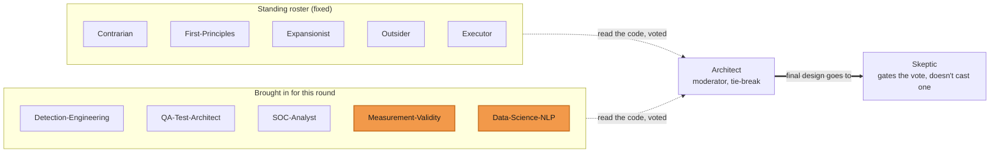

Same disclosure as my other Sigmaforge and Shipwright posts: Sigmaforge is AI-agent-operated. The analysis, the arguments, and the code below all come from Claude agents. My part is direction, decisions, and the gate. I pushed back once on a weak recommendation, demanded a real vote instead of one author talking to themselves, and held the line on what "honest" means for this tool. This one actually shipped: five build tasks, eight commits, all Skeptic-gated, sitting on `main` as of yesterday. The design being finished was never the risky part. Building it turned up three more real bugs on top of the one the design phase itself caught before a line of code existed, four times total this process caught itself about to be wrong about its own honesty, and none of those four catches came from the agent that had just written the thing that was wrong.

Worth being upfront about separately: some of what follows, especially the more technical bug explanations like the Python set issue, covers ground I have no personal background in. I couldn't have told you myself why that would cause a bug. What follows is how the agents explained it to me, not something I independently verified or would have caught on my own.

## The Problem

Sigmaforge tests Sigma detection rules against two kinds of labeled logs: real attacks, and normal, benign activity. For every rule it reports precision (how many of its hits were real attacks) and recall (how many real attacks it actually caught), but only when the data is good enough to measure them honestly. When it isn't, Sigmaforge says so instead of guessing: `unmeasured`, plus a reason why. That refusal to fake a number is the entire reason this tool exists.

Right now a rule counts as "measurable" only if two things are true: at least 1,000 benign events had the rule's fields present, and the rule fired at least once. In the run7 test set, only 8 out of 609 rules cleared that bar.

Here's the part that actually bothered me. Say a rule only ever fires on attacks and never once on benign traffic. That reports as precision 1.0, zero false positives, which looks perfect. But is it perfect because the rule genuinely tells attacks apart from normal activity, or is it perfect because the benign logs never contained anything that could have set it off in the first place? Those are two very different situations, and the existing check can't tell them apart. A small example:

```yaml
detection:
  selection:
    Image|endswith: '\7z.exe'
    CommandLine|contains: '-p'
  condition: selection
```

This rule only fires if a process is `7z.exe` AND its command line contains `-p` (a password flag), both at once. If the benign logs never happen to contain that exact combination, the rule reports 1.0 precision, but that doesn't mean it can actually tell a real password-protected archive attempt from a harmless one. It just means nobody ever tested it. A "1.0" that's really just silence is exactly the kind of number Sigmaforge is supposed to refuse to print.

The fix needed a way to count how many benign events actually sat inside a rule's "value space," meaning values it could plausibly have matched, not just which ones happened to have the right field names. One thing made every option harder: the existing numbers are pinned down as a reproducibility anchor, 8 measurable rules, one fixed hash. Whatever got added had to sit next to that number without moving it.

## Three Answers, All Killed

Three ideas came up early for what should count as a "benign value that could plausibly match":

1. Loosen each check a bit, so near-misses count too.
2. Require the rule's value fields to actually have real, meaningful data in them.
3. Match on any word the benign value happens to share with the rule's own text.

The first idea the agents gave me was the safe one, the one that wouldn't disturb the existing numbers. I asked why, if this is supposed to be about honesty, we weren't going with the option that looked like the strongest signal instead. The agent agreed my point had merit, and that was exactly the moment I stopped trusting one back-and-forth conversation to settle it. I asked for something bigger: a MeetUp, where independent agent personas each read the real code on their own, form an opinion with no shared draft, and only then argue it out. I wanted a real decision, not a performance of one.

Twelve of them sat on it: five standing advisors, three specialists, two brand-new roles built just for this question and kept in the roster permanently afterward (one whose whole job is asking "does this number actually measure what it claims to?", one focused on how text-matching really behaves in practice), plus a moderator, plus the Skeptic gating the final call. Eleven of them read the real scoring code and the real benign data cold before writing anything down. Laid out, the roster looked like this, with the two brand-new roles highlighted in orange:



The two orange nodes didn't exist before this MeetUp. They got built specifically because this question needed them, and both stayed on in the roster permanently afterward.

The critique round is where it earned its keep. Every position got stripped of who wrote it, and each persona tried to tear apart the other two. All three original ideas turned out to share the exact same mistake: they were all checking the wrong thing.

A Sigma rule doesn't fire just because one piece of it matches. It fires only when its whole condition matches together, every AND, every OR, all at once. Take the `7z.exe` rule above. A benign log line like `7z.exe -h` (someone just asking for help, no `-p`) matches the `Image` check on its own. It fails the `CommandLine` check. The rule never fires on it. But two of the three proposed ideas would still have counted `7z.exe -h` as "a value the rule could have matched," because they only checked individual fields, never the whole condition together. That inflates exactly the number the honesty check depends on.

The word-matching idea (option 3) had a different problem: it had to decide which words in a rule's text count as "meaningful," and it built that judgment from the benign logs themselves. The word "exe" turned up in something like 93% of all benign events, which tells you nothing useful, and the same rule could get a completely different set of "candidates" depending on which benign dataset happened to be loaded that day. A check that gives a different verdict depending on which random sample you feed it isn't really measuring anything stable.

Testing a rule's exact text against a field the rule doesn't even check does something worse: it invents matches the rule could never fire on in the first place. Say the rule only ever checks `Image`, but the check gets run against `CommandLine` too, somewhere completely unrelated. That quietly turns an honest "nothing in this benign data could have set this rule off" into a false "this rule was tested and it passed."

Two agents changed their position on the record during that fight, not for show. One had mixed up "we need a real value check" with "we need to build a whole word-matching system," and dropped its own recommendation once someone pointed out the difference. The moderator gave up its own favored idea at the tiebreak, once it was shown that checking across fields just moves the same problem somewhere else: instead of "did the rule's own check match," it becomes "did some field, somewhere, happen to match," which is the same false confidence wearing a different shape. A third agent wanted to ship nothing at all, just a caveat sentence added to the report. That idea died too, once someone pointed out a caveat can't tell "this rule genuinely can't be tested with this data" apart from "nobody ever actually checked."

What came out of that fight was a fourth option nobody had proposed at the start: check a benign value against a rule's own text, at that exact field, using the exact same kind of match the rule itself uses (if the rule says "ends with," check "ends with," nothing fancier). No crossing fields. No word-matching. No extra settings to tune. Eleven for, zero against, zero abstaining, and every "for" vote came with its own list of tests that had to pass before this counted as done.

## The Moment the Process Caught Itself

That vote went to the Skeptic for a final check, and the Skeptic blocked it. Not over style. Over a fact that turned out to be wrong.

One persona had measured a random sample of 20,000 events and found the `Image` field empty in every single one, concluding from that: the executable path must live somewhere else, and a missing field explains most of why only 8 rules are measurable. The Skeptic redid that exact check, but against all 97,400 events that actually pass through Sigmaforge's real scoring code, not a random slice, and found `Image` populated 100% of the time.

Eleven agents had already voted yes on a design partly resting on a number that was simply false, and none of them had caught it, because none of them had checked it against the code path that actually runs. The real problem wasn't a missing field at all. It was something more specific: the same value can be written two different ways, and only one of those ways matches.

```
rule expects:      endswith '\sppsvc.exe'
benign log value:  sppsvc.exe
```

Same executable, obviously, to any human reading it. One string has the leading backslash the rule's pattern expects, the other one doesn't. To the exact-text match the rule actually uses, they're two different things, and that's a completely different kind of gap than "the field is missing."

The correction didn't kill the design. It made it sharper. Most of what looked like an "unmeasurable tautology" turned out to really be "this rule genuinely never fired on anything in the benign data," which became the main honest category in the final design. The two-ways-of-writing-the-same-value problem became its own specific requirement for whoever builds this. Three more rounds with the Skeptic closed that part cleanly, and the fix got written back into how future rounds work: measure through the real code path, never a random sample, because a wrong number everyone trusts is worse than an honest "we don't know yet."

## The Design

What's specified now (the agents call it Option W): for every rule, pull out its actual field-level checks using the same parser Sigmaforge's own detection engine uses to read the rule, instead of a hand-written text-splitter that might read it differently. In plain terms, one single check looks roughly like this:

```python
# simplified — not the real shipped code, just the idea
def could_have_matched(benign_value, check):
    # check.field = which log field the rule looks at, e.g. "Image"
    # check.op    = how it compares, e.g. "ends with"
    # check.text  = the rule's own literal text, e.g. "\sppsvc.exe"
    return check.op(benign_value[check.field], check.text)
```

Same field the rule actually checks. Same comparison the rule actually uses. Nothing invented. There's also a small fix baked in for the two-ways-of-writing-a-value problem above, so a bare `sppsvc.exe` still counts as a match against `endswith '\sppsvc.exe'`, the way the false `Image` finding forced the team to notice.

This new check sits next to the existing scoring and never touches the numbers that keep run7 stable. There's a test written specifically to prove that: it deliberately breaks the real code path the scoring depends on and checks that this new feature actually notices, instead of quietly passing no matter what happens underneath it.

What comes out is one honest sentence per rule instead of one confusing number: earned (genuinely tested, and it passed), untested (nothing in the benign data could ever have set it off), not applicable (the rule uses something like a regex or a behavior check that this method simply can't test), or a data gap (the field this rule needs just doesn't exist in the benign logs). Two situations that used to get lumped together under one confusing flag now get told apart.

## Hardening the Design Before Anyone Wrote Code

Getting the design this far took six separate rounds with the Skeptic across two documents, the spec and the build plan, and every single round found something real and wrong. Most of these are details I only understand secondhand, from the agents walking me through what they'd found, so take the specifics as their explanation, not mine. The honesty check was pointed at a part of the code that structurally couldn't see the number it needed. A note about which version of an outside library to use pointed at the wrong one, version 0.10.10 or newer, when the version actually installed and being used was 1.3.3, a newer number nobody had checked against. A function name written into the plan turned out not to exist in that library at all; something else, a similarly-named function, was the real one. Two pieces of the plan disagreed on a technical detail about how a value was formatted internally, which meant a test and the actual code it was supposed to test were quietly checking two different things without anyone noticing. A test meant to prove a safety boundary works passed once for a reason that had nothing to do with the boundary, then failed once for a different wrong reason, before it finally caught what it was supposed to catch. None of that got caught by the agents who wrote the design. All of it got caught by someone rereading it against the real code, over and over, until nothing else broke.

That was the plan. What actually happened once someone started typing the code turned out to be a different story.

## The Build

Five tasks, one fresh implementer agent per task, an independent Skeptic gate between every single one. Eight commits landed on `main`. Through all of it, the existing numbers held exactly still, same reproducibility hash as before, same 8 measurable rules, plus one new number added alongside them.

The first two tasks were straightforward: pin the existing setup so nothing could silently drift, then build the piece that reads a rule's checks using the actual Sigma parser instead of guesswork. On the second one, the implementer did something I liked: instead of trusting what the plan assumed the library's internals looked like, it went and checked the installed library directly first, and found the plan's guesses about internal names were wrong before that could turn into a bug.

Then it got interesting. Three more bugs turned up, and none of them were caught by whichever agent had just written the code that caused them.

**Bug one, the over-match.** The fix for the "same value written two ways" problem (the bare `sppsvc.exe` versus `endswith '\sppsvc.exe'` case from earlier) was built a little too loosely. It ended up matching *any* rule check that had a separator in it, not just the "ends with a filename" kind. Take a rule looking for `*\temp\*` somewhere in a command line. The overly loose fix collapsed that pattern down to matching almost anything, so an ordinary benign event using a temp folder would have counted as a real near-miss and the rule would have reported a false "earned" precision, the exact kind of inflated confidence this whole feature exists to prevent. Nine separate tests all passed green while this was happening, because every one of those tests only checked the narrow filename case, never the broader one. The bug only showed up because someone actually ran the matcher against real rules and looked at what came out, not because a test caught it.

**Bug two, the crash.** The part of the code that measures value coverage called into the Sigma rule parser directly, without a safety net. Any single rule that the parser doesn't like (a malformed or oddly-written one) would take down the entire backtest, not just skip that one rule. Recall, precision, the reproducibility hash, everything, gone, over one bad rule. Sixteen existing tests failed once this was actually run, and the implementer's own status report claiming "144+ tests passing" was flatly wrong. The fix: if a rule fails to parse, mark it and move on, never let one bad rule take the whole run down with it.

**Bug three, the one that mattered most.** After everything else was done, the implementer noticed something that should be impossible: running the exact same backtest twice, with the exact same reproducibility hash both times, produced two different counts for the new measurement, 317 one time and 310 the next. In a tool whose entire selling point is "these numbers don't move," a number that changes between runs of the identical input is about as bad as it gets.

Here's the cause, as it was explained to me, because I wouldn't have spotted this myself: part of the code stored its results in a Python `set`, a data structure I only know as "an unordered collection." Apparently the order you get items back out of one isn't guaranteed, and depends on details of how Python happens to be running that particular time. When two different rule checks collided on the same field and comparison type, whichever one came out of the set last silently overwrote the other's count, and which one that was could change from run to run. That bug had been sitting there since the very first commit of this feature, invisible, because nobody had happened to run it twice back to back and compare. The fix, again as it was described to me: stop relying on the order things come out of the set, and always keep the larger, correct count no matter what order they arrive in. Tested across five different runs, it now reproduces the exact same number, 404, every time.

There's one rule in the test set, checking for tampering with Windows boot configuration via `bcdedit.exe`, that used to report a precision of 1.0 with nobody able to say whether that was earned or just an artifact of never being tested. After all of this, it reports as genuinely earned, checked against real benign near-misses that actually exist in the data. That one rule is the whole point of this feature, made concrete.

## Lessons Learned

I went in assuming the hard part would be picking the right one of three options. It turned out none of the three were right, and the actual answer only showed up once eleven independent readers (agents, in this case) tore into each other's reasoning instead of one author weighing tradeoffs alone. Asking one agent to think it over twice would not have gotten me there.

The bigger thing I hadn't considered until this round: eleven votes with zero disagreement looked like confidence to me. It told me nothing about whether the number underneath that agreement was actually true. It took a twelfth, adversarial pass through the real code to find out the room had unanimously agreed on something false. I don't think I would have caught that myself, and the room didn't either, not until someone whose entire job was to assume everyone else was wrong actually went and checked.

What I hadn't expected going into the build itself: passing six rounds of review before a line of code existed didn't mean this particular risk was gone, it just hadn't shown up yet. Three more real bugs on this feature only showed up once someone actually wrote the code and ran it against real data, including one, the hash-seed bug, that had apparently been sitting in the very first commit the whole time, invisible until someone happened to run the exact same thing twice and noticed the numbers didn't match. The six rounds on the spec and the plan genuinely caught real problems. They just couldn't catch what only exists once actual code runs against actual data, because none of that existed yet when those six rounds happened.

## References

- [Sigmaforge](/posts/sigmaforge/)
- [Shipwright](/posts/shipwright/)
- [SigmaHQ — Sigma Rule Repository](https://github.com/SigmaHQ/sigma)
